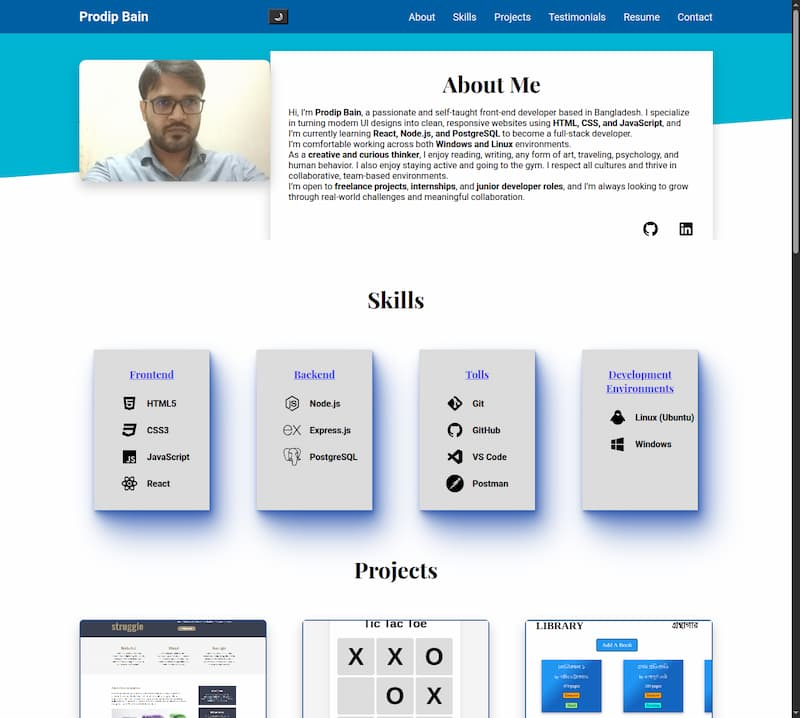
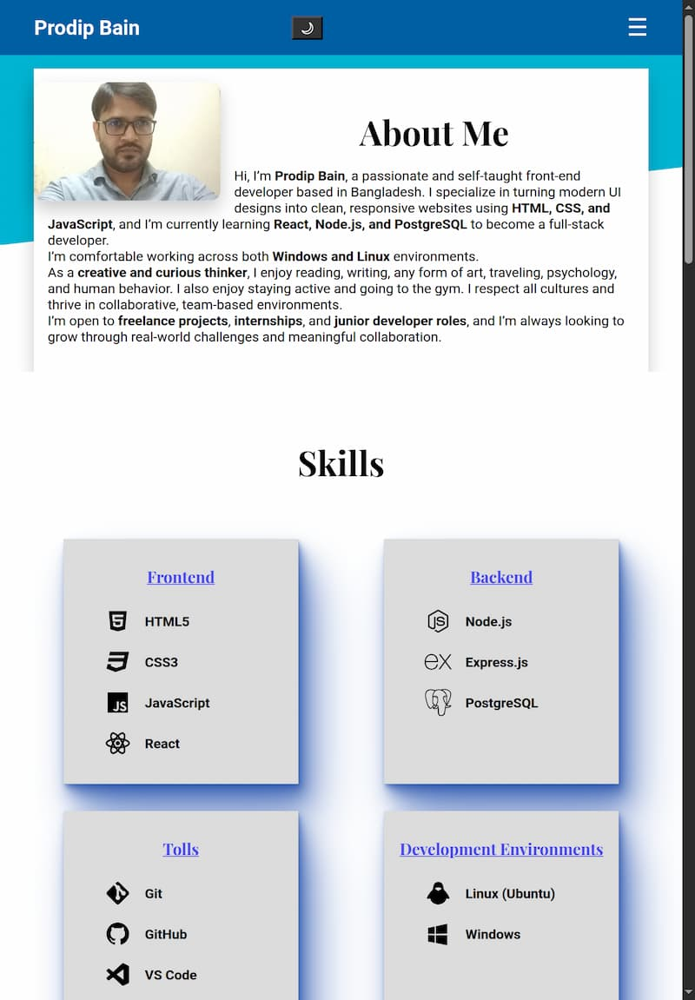
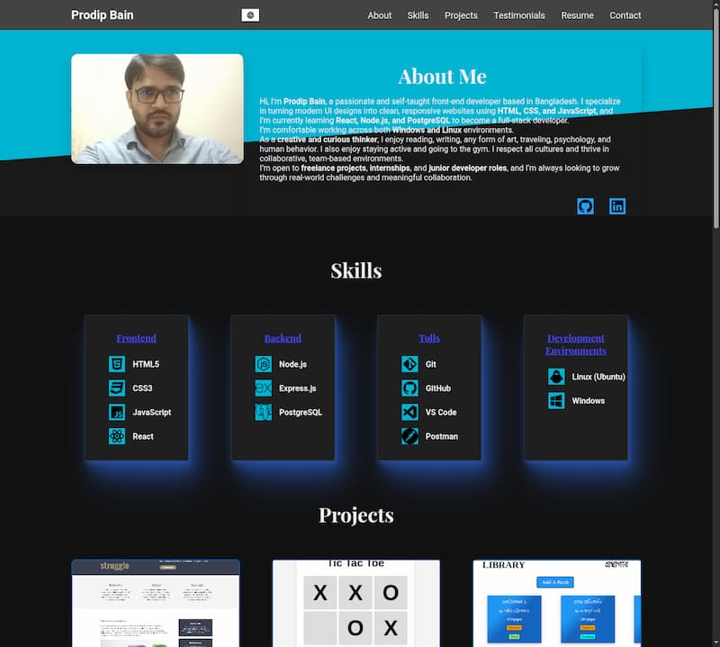

# Personal Portfolio Website

## [Live Demo](https://pbain63.github.io/portfolio)

---

## Overview

Welcome to my personal portfolio website. This project showcases my skills, projects, and experience as a web developer. It is fully responsive, designed with HTML, CSS, and JavaScript, and hosted on GitHub Pages.

This portfolio helps you:

- Present my skills and feature projects professionally
- Highlight my projects visually
- Attract potential clients or employers

---

## Sections Included

- **About Me** — a brief introduction and background
- **Skills** — technical proficiencies (HTML, CSS, JavaScript, etc.)
- **Projects** — visual cards with project titles and links
- **Testimonials** — space to add feedback from clients or collaborators
- **Resume** — link to download or view my CV
- **Contact** — email link and social profiles

---

## Features

- **Responsive Design** — Optimized for desktop, tablet, and mobile devices
- **Smooth Navigation** — Includes About, Skills, Projects, Testimonials, Resume, and Contact sections
- **Mobile Hamburger Menu** — Simplified navigation for smaller screens
- **Testimonials Section** — Placeholder for future client reviews
- **Downloadable Resume** — Linked to resume
- **Contact Form** — Built with a simple HTML form (form functionality coming soon)

---

## Technologies Used

- **HTML5** — structured, semantic markup
- **CSS3** — modern styling with responsiveness
- **JavaSCript** — toggle hamburger menu, dark mode, and back to top button
- **Media Queries** — tablet and mobile-friendly layout
- **Git & GitHub** — version control and hosting

---

## Screenshots

| Desktop View                                         | Tablet View                                        | Mobile View                                        | Desktop Dark Mode View                                              |
| ---------------------------------------------------- | -------------------------------------------------- | -------------------------------------------------- | ------------------------------------------------------------------- |
|  |  |  |  |

---

## Responsive Design

- Mobile-first layout
- Fully responsive navigation
- Clean spacing and hierarchy
- Scroll behavior and adaptive images

---

## Lessons Learned

- Toggle hamburger menu properly with landscape view

- Toggle dark mode, adjust colors of the page

- Back to top button functionality and positioning

---

## Future Improvements

- Connect contact form to Formspree or Netlify Forms.

- Add real testimonials from clients or collaborators.

- Refine UI with better fonts and color palette.

- Link more real-world projects and case studies.

---

## Getting Started

### 1. Clone this Repository

```bash
git clone https://github.com/pbain63/Project_Homepage.git
```

### 2. Open in Browser

Just open the `index.html` file in any modern browser or use a Live Server extension.

### 3. Deploy on GitHub Pages

If you fork this repo:

- Go to your forked repo's **Settings > Pages**
- Select the `main` branch and root folder (`/`)
- GitHub will deploy your site in a few seconds

---

## Contributing

Contributions are welcome! Here’s how:

1. Fork the repository
2. Create a feature branch (`git checkout -b feature/AmazingFeature`)
3. Commit your changes (`git commit -m 'Add amazing feature'`)
4. Push to the branch (`git push origin feature/AmazingFeature`)
5. Open a Pull Request

---

## Images Used

- **Middle Section Background**  
  Artwork: _Fallen Angel_  
  Source: Collected from the internet  
  Artist: Unknown  
  Copyright: Unknown

- **Footer Section Image**  
  Artwork: _The Fallen Angel (painting)(1847)_  
  Artist: Alexandre Cabanel (1823–1889)  
  Source: [Wikipedia](<https://en.wikipedia.org/wiki/The_Fallen_Angel_(painting)#/media/File:Fallen_Angel_(Alexandre_Cabanel)_crop.jpg>)  
  License: Public Domain

---

## Connect With Me

LinkedIn: https://www.linkedin.com/in/prodipbain

GitHub: [GitHub](https://github.com/pbain63)

Email: prodipbain63@gmail.com

---

## License

This project is open source and available under the [MIT License](LICENSE).

---

Made with ❤️ by [Prodip Bain](https://github.com/pbain63)
